<div align="center">

# AURORA A1

### F1 concept car built in FreeCAD by an AI agent

コンセプト画像3枚をもとに、AIエージェント（Claude Code）が **FreeCAD MCP** 経由で FreeCAD を操作して設計した F1 コンセプトカー

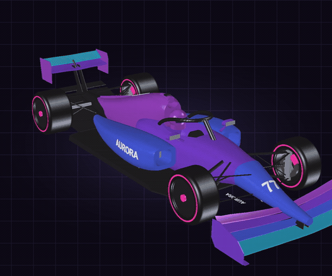

[](https://www.freecad.org/)
[](#-パラメトリックな3dモデル)
[](#-freecad-で出図)
[](aurora_a1)
[](https://sunwood-ai-labs.github.io/aurora-a1-grand-prix/)

</div>

---

## ✨ このリポジトリにあるもの

| | 成果物 | 場所 |
| --- | --- | --- |
| 🧊 | **3Dアセンブリモデル**（84部品・12サブアセンブリ） | [`aurora_a1/AURORA_A1.FCStd`](aurora_a1/AURORA_A1.FCStd) ・ [`.step`](aurora_a1/AURORA_A1.step) |
| 🐍 | **モデルを一から生成する Python スクリプト** | [`aurora_a1/build_aurora_a1.py`](aurora_a1/build_aurora_a1.py) |
| 📐 | **A3図面 11枚**（三面図・断面図・部品表） | [`aurora_a1/drawings/`](aurora_a1/drawings)（PDF / DXF） |
| 🎬 | **メイキング動画 2本**（HyperFrames 製） | [`videos/`](videos) |
| 🏁 | **このモデルで走る Web レースゲーム** | [AURORA A1 Grand Prix](https://sunwood-ai-labs.github.io/aurora-a1-grand-prix/) |

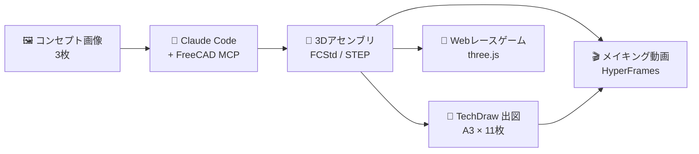

---

## 🖼️ 入力：コンセプト画像3枚

走行イメージ、三面図・主要諸元のシート、分解イラストの3枚（架空のF1コンセプト）を渡し、「このF1マシンのアッシーモデルを再現して」と頼んだところから始まっています。

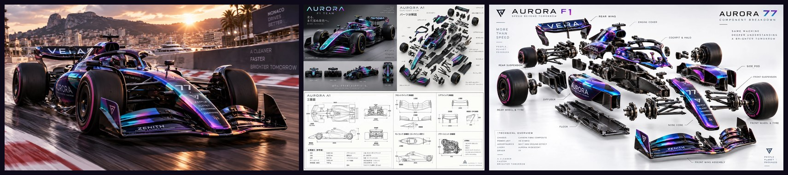

---

## 🧊 パラメトリックな3Dモデル

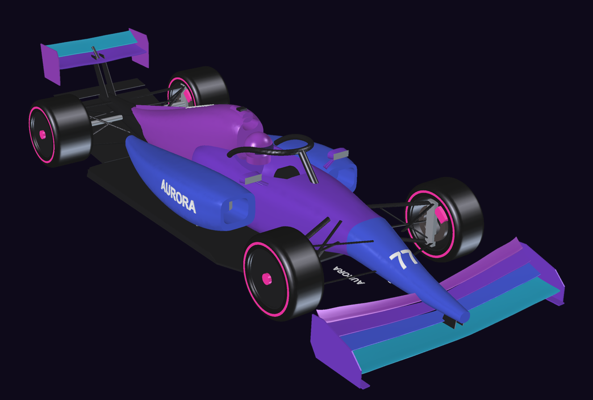

GUI を手で操作するのではなく、**寸法を変数にした Python スクリプト 1本**（[`build_aurora_a1.py`](aurora_a1/build_aurora_a1.py)）でアセンブリ全体を生成しています。

- **胴体・ノーズ・サイドポッド**：スーパー楕円の断面を並べてロフト
- **ウイング**：逆 NACA 翼型（ダウンフォース向き）を翼幅方向にロフト
- **サスペンション**：楕円断面（エアロ形状）のアーム
- **構成**：`App::Part` で Chassis / Aerodynamics / PowerUnit / Drivetrain / Suspension / Wheels / Livery に階層化
- **デカール**：押し出した文字をボディ表面と交差させ、曲面に沿ったロゴを作成

```python
def sec(x, yc, zb, zt, hw, n=2.8, N=40, flat_bottom=False):
    """Closed superellipse section in the YZ plane at station x."""
    ...
nose = Part.makeLoft([sec(-1050, 0, 150, 235, 50, n=2.4),
                      sec(-450, 0, 180, 390, 130, n=2.6),
                      sec(0, 0, 250, 545, 205, n=3.0)], True)
```

### サブアセンブリごとの組み上がり

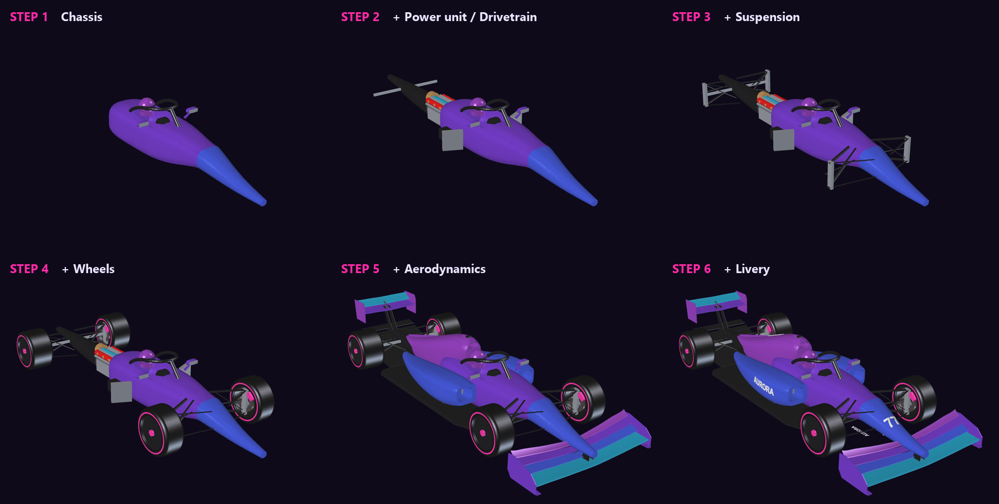

### 主要諸元

| 項目 | 値 |
| --- | --- |
| 全長 × 全幅 × 全高 | 5,640 × 2,002 × 965 mm（図面値 5,600 × 2,000 × 950） |
| ホイールベース | 3,600 mm |
| トレッド（前 / 後） | 1,620 / 1,595 mm |
| タイヤ（前 / 後） | 305/660 R18 ・ 405/670 R18 |
| 構成 | 84部品・12サブアセンブリ（全ソリッド有効） |
| 初回ビルド時間 | 約 54 秒 |

<table>
<tr>
<td width="50%">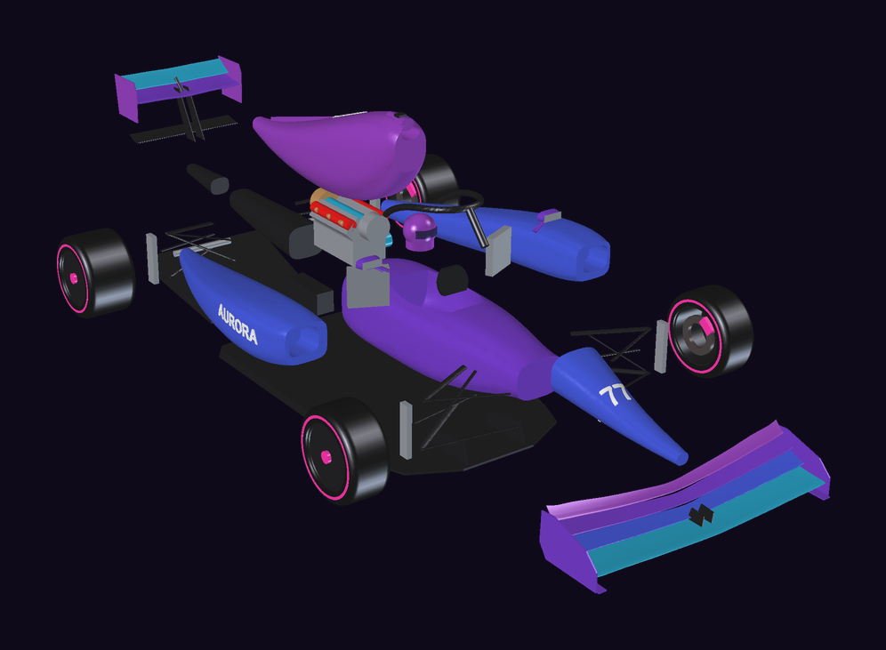<br><sub>分解図（<code>explode()</code> でサブアセンブリごとにオフセット）</sub></td>
<td width="50%">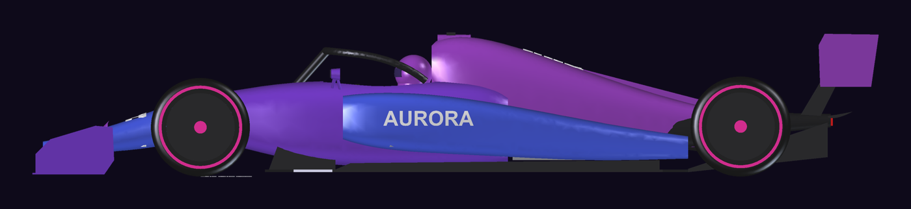<br><sub>側面図</sub></td>
</tr>
</table>

---

## 🔍 見て、測って、直す

エージェントはビルド後に自分でスクリーンショットを撮り、見た目と数値の両方で問題を探して直しています。

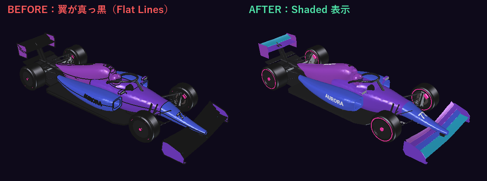

| 見つけた問題 | 原因 | 対策 |
| --- | --- | --- |
| ウイングが真っ黒に見える | 翼型が直線約56本の多角形で、面の境界線が色を覆っていた | 表示を Shaded にし、後に翼型を B-spline 化（面数 56 → 3） |
| サイドポッドのロゴが作れない | `Geom_BSplineSurface: Weights values too small`（オフセット面の失敗） | 6 mm 外側へずらした複製と交差させる方式に変更 |
| 外装から部品がはみ出す | 排気管が外装の外に **1,702,404 mm³** 出ていた | ブーリアン差分で「はみ出し体積」を測って位置を修正 |
| リアウイングの翼端板が高い | 推定寸法のずれ | 570 mm → 350 mm（図面値 320 mm） |

---

## 📐 FreeCAD で出図

TechDraw ワークベンチで **A3図面 11枚** を出力しました（PDF / DXF）。生成スクリプトは [`make_drawings.py`](aurora_a1/make_drawings.py) です。

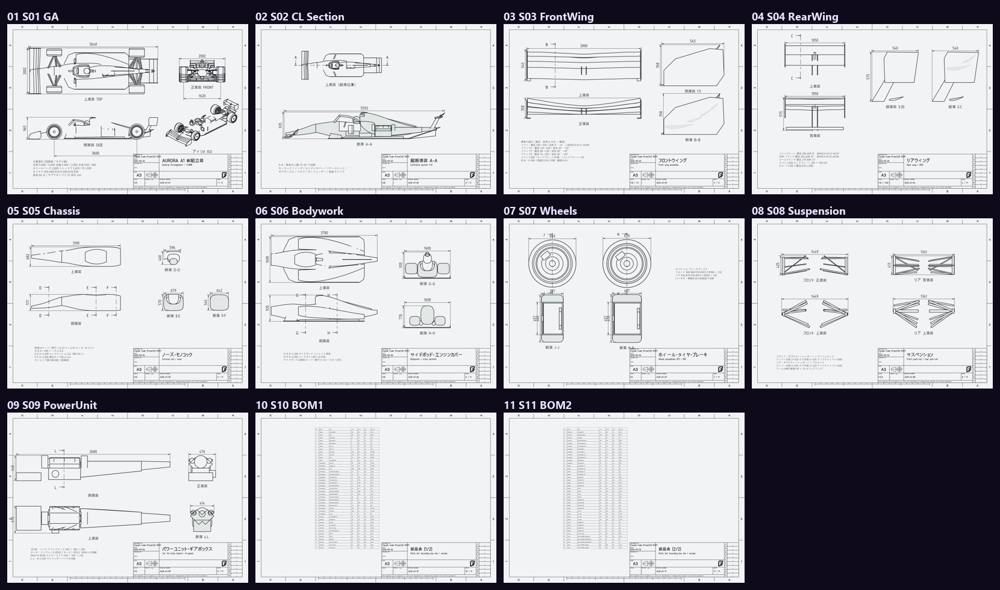

| No. | 内容 | No. | 内容 |
| --- | --- | --- | --- |
| [01](aurora_a1/drawings/01_S01_GA.pdf) | 総組立図（三面図＋アイソメ） | [07](aurora_a1/drawings/07_S07_Wheels.pdf) | ホイール・タイヤ・ブレーキ（断面 J・K） |
| [02](aurora_a1/drawings/02_S02_CL_Section.pdf) | 縦断面図 A-A（車体中心線） | [08](aurora_a1/drawings/08_S08_Suspension.pdf) | サスペンション |
| [03](aurora_a1/drawings/03_S03_FrontWing.pdf) | フロントウイング（断面 B-B） | [09](aurora_a1/drawings/09_S09_PowerUnit.pdf) | パワーユニット・ギアボックス（断面 L） |
| [04](aurora_a1/drawings/04_S04_RearWing.pdf) | リアウイング＋DRS（断面 C-C） | [10](aurora_a1/drawings/10_S10_BOM1.pdf)–[11](aurora_a1/drawings/11_S11_BOM2.pdf) | 部品表（84点の外形寸法・体積） |
| [05](aurora_a1/drawings/05_S05_Chassis.pdf) | ノーズ・モノコック（断面 D・E・F） | | |
| [06](aurora_a1/drawings/06_S06_Bodywork.pdf) | サイドポッド・エンジンカバー（断面 G・H） | | |

<details>
<summary><b>図面を大きく見る（01 総組立図 / 02 断面 A-A / 03 フロントウイング / 07 ホイール）</b></summary>

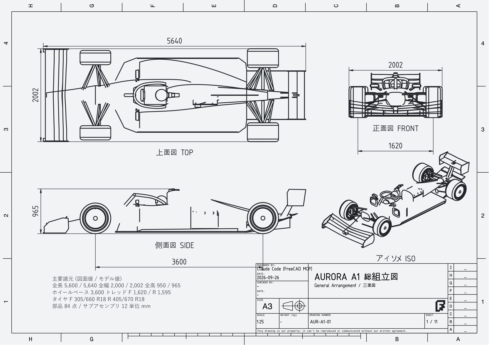
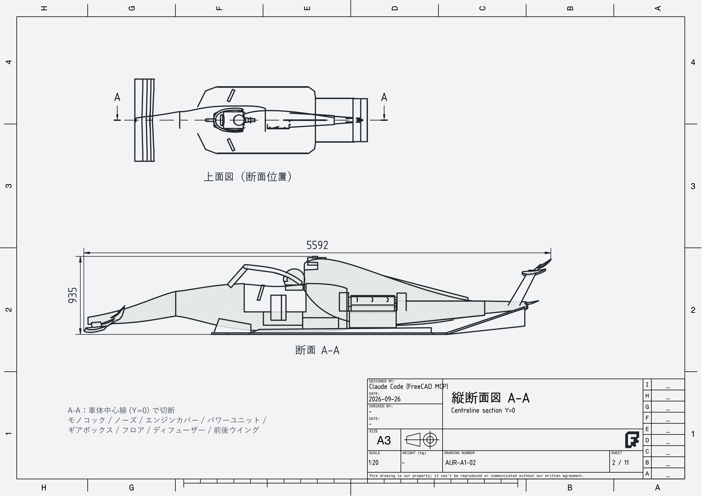
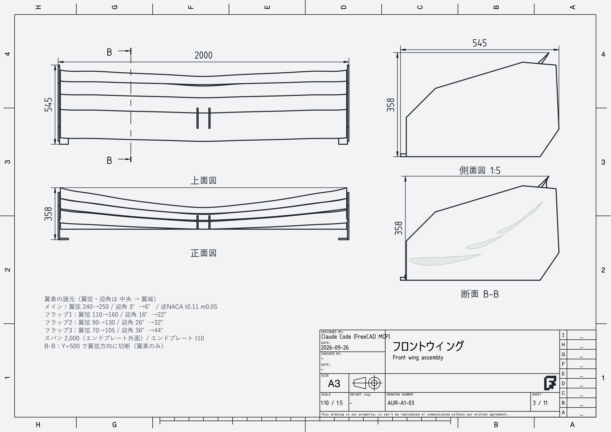
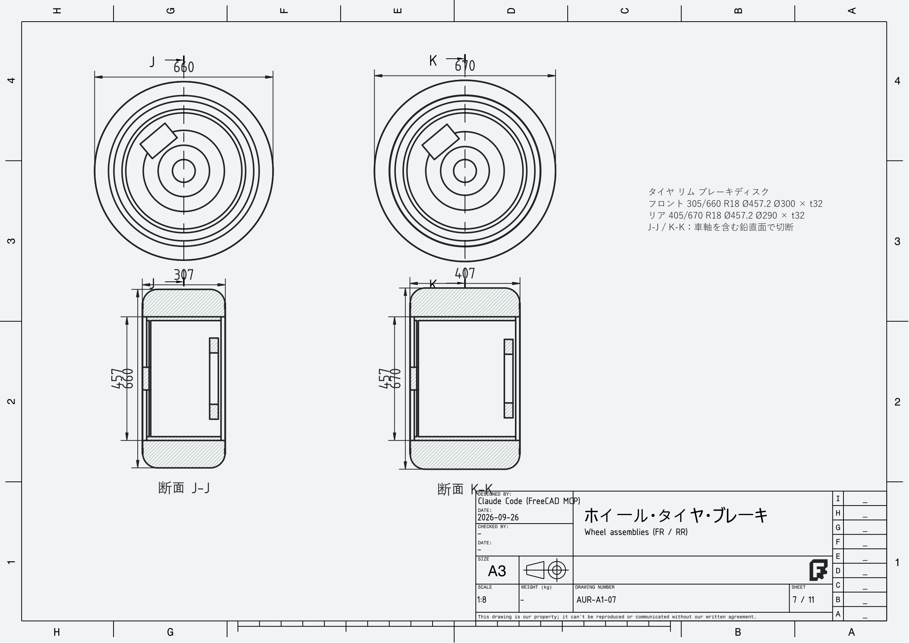

</details>

---

## 🎬 メイキング動画

作業ログをもとに、[HyperFrames](https://hyperframes.heygen.com/)（HTML＋GSAP）で動画を2本作りました。BGM も Python（numpy）で合成した自作音源です（[`scripts/synth_bgm.py`](videos/aurora-a1-making/scripts/synth_bgm.py)）。

<table>
<tr>
<td width="50%"><a href="videos/aurora-a1-making/renders/aurora-a1-making.mp4">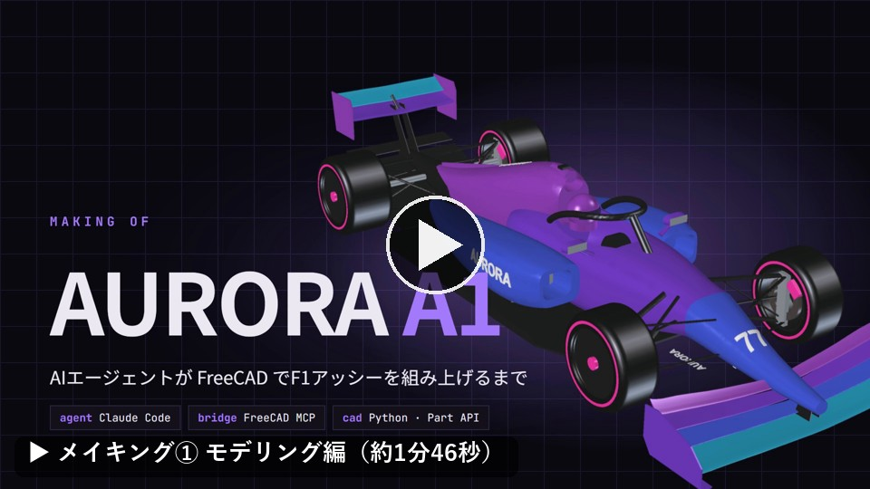</a><br><sub>① モデリング編：接続確認 → 寸法読み取り → ビルド → 検証ループ → 分解図</sub></td>
<td width="50%"><a href="videos/aurora-a1-drawings-making/renders/aurora-a1-drawings-making.mp4">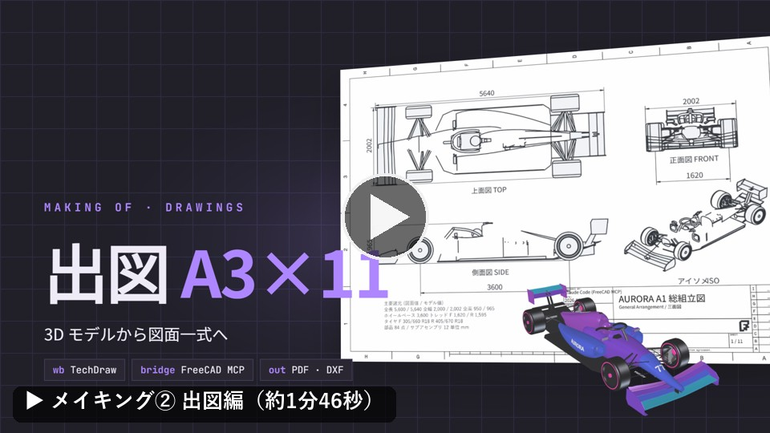</a><br><sub>② 出図編：TechDraw の試作 → モデル修正 → A3 × 11枚</sub></td>
</tr>
</table>

---

## 🏁 このモデルで走る：AURORA A1 Grand Prix

このリポジトリの CAD モデルを GLB に書き出し、ブラウザで走れるレースゲームにしました。

[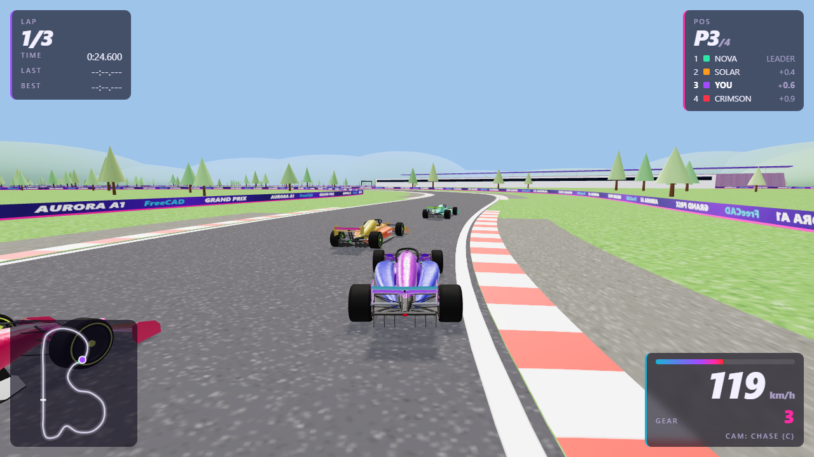](https://sunwood-ai-labs.github.io/aurora-a1-grand-prix/)

**▶ [今すぐプレイ](https://sunwood-ai-labs.github.io/aurora-a1-grand-prix/)** ・ [ソースコード](https://github.com/Sunwood-ai-labs/aurora-a1-grand-prix)

---

## 📁 ファイル構成

```
aurora_a1/
  build_aurora_a1.py      アセンブリ全体を生成する FreeCAD Python スクリプト（モデルのソース）
  AURORA_A1.FCStd         FreeCAD モデル
  AURORA_A1.step          STEP 出力
  make_drawings.py        図面（TechDraw）生成スクリプト
  render_making_assets.py 動画用レンダー画像の生成スクリプト
  drawings/               A3図面 11枚（PDF / DXF）
videos/
  aurora-a1-making/           メイキング動画①（HyperFrames プロジェクト＋レンダー済み mp4）
  aurora-a1-drawings-making/  メイキング動画②
docs/images/              README 用の画像
```

## 🔧 モデルの再生成

FreeCAD 1.1 の Python コンソールで次を実行すると、アセンブリを一から作り直せます。

```python
import sys; sys.path.insert(0, r"<このリポジトリ>/aurora_a1")
import build_aurora_a1
build_aurora_a1.build()          # 組立状態
build_aurora_a1.explode(App.ActiveDocument, 1.0)   # 分解図（0 で元に戻す）
```

座標系：X＝後方（前車軸が X=0）、Y＝横方向、Z＝上方向（地面が Z=0）、単位は mm です。

## ⚠️ 限界（正直ポイント）

- 虹色（イリデセント）塗装は再現できないため、紫・青・ティールで塗り分けています。
- スポンサーロゴや細かい空力パーツは省略しています。
- 図面にない寸法はコンセプト画像からの推定です。

## 🛠️ 使ったツール

- [Claude Code](https://claude.com/claude-code)：設計作業を進めたAIエージェント
- [FreeCAD](https://www.freecad.org/) 1.1.3 と FreeCAD MCP
- [HyperFrames](https://hyperframes.heygen.com/)：メイキング動画の制作
