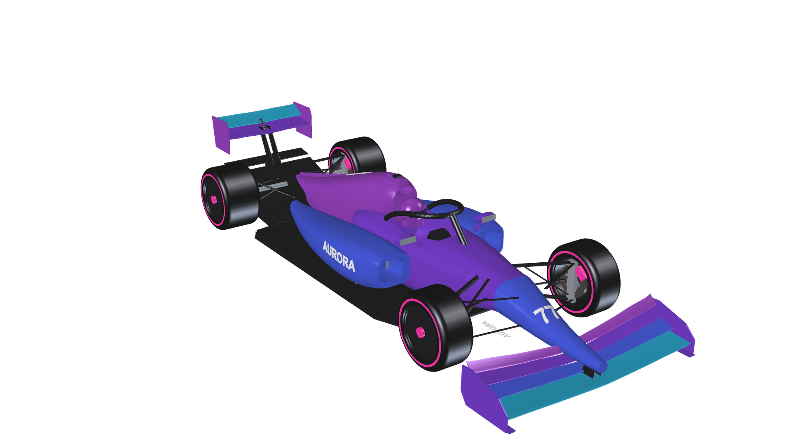
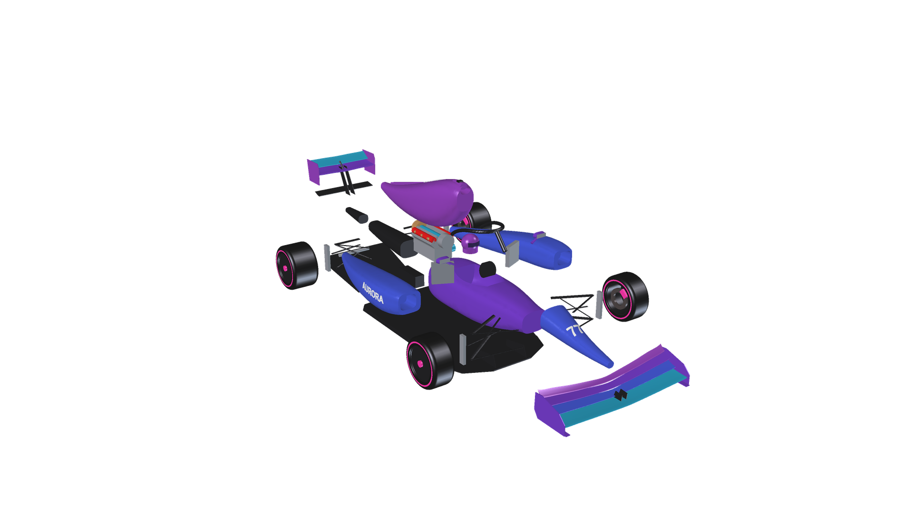

# AURORA A1 — F1 concept car built in FreeCAD

**An F1 concept car designed in FreeCAD by an AI agent (Claude Code + FreeCAD MCP), starting from three concept images.**

コンセプト画像3枚をもとに、AIエージェント（Claude Code）が FreeCAD MCP 経由で FreeCAD を操作して設計した F1 コンセプトカーです。
3Dアセンブリモデル、A3図面11枚、メイキング動画2本をまとめています。



🏁 **このCADモデルで走れるWebレースゲーム → [AURORA A1 Grand Prix](https://sunwood-ai-labs.github.io/aurora-a1-grand-prix/)**（[repo](https://github.com/Sunwood-ai-labs/aurora-a1-grand-prix)）

## 主要諸元

| 項目 | 値 |
| --- | --- |
| 全長 × 全幅 × 全高 | 約 5,640 × 2,000 × 965 mm |
| ホイールベース | 3,600 mm |
| トレッド（前 / 後） | 1,620 / 1,595 mm |
| タイヤ径 × 幅（前 / 後） | 660 × 305 / 670 × 405 mm（R18 リム） |
| 構成 | 84部品・12サブアセンブリ |

## 内容

```
aurora_a1/
  build_aurora_a1.py      アセンブリ全体を生成する FreeCAD Python スクリプト（モデルのソース）
  AURORA_A1.FCStd         FreeCAD モデル
  AURORA_A1.step          STEP 出力
  make_drawings.py        図面（TechDraw）生成スクリプト
  render_making_assets.py 動画用レンダー画像の生成スクリプト
  drawings/               A3図面 11枚（PDF / DXF）
videos/
  aurora-a1-making/           メイキング動画①：モデリング編（HyperFrames）
  aurora-a1-drawings-making/  メイキング動画②：図面編（HyperFrames）
```

- 完成動画：[`videos/aurora-a1-making/renders/aurora-a1-making.mp4`](videos/aurora-a1-making/renders/aurora-a1-making.mp4) と [`videos/aurora-a1-drawings-making/renders/aurora-a1-drawings-making.mp4`](videos/aurora-a1-drawings-making/renders/aurora-a1-drawings-making.mp4)
- 三面図：[`aurora_a1/drawings/01_S01_GA.pdf`](aurora_a1/drawings/01_S01_GA.pdf)



## 図面一覧

| No. | 内容 |
| --- | --- |
| S01 | 三面図（GA） |
| S02 | センターライン断面 |
| S03 | フロントウイング |
| S04 | リアウイング |
| S05 | シャシー |
| S06 | ボディワーク |
| S07 | ホイール |
| S08 | サスペンション |
| S09 | パワーユニット |
| S10–S11 | 部品表（BOM） |

## モデルの再生成

FreeCAD 1.1 の Python コンソールで次を実行すると、アセンブリを一から作り直せます。

```python
import sys; sys.path.insert(0, r"<このリポジトリ>/aurora_a1")
import build_aurora_a1
build_aurora_a1.build()
```

座標系：X＝後方（前車軸が X=0）、Y＝横方向、Z＝上方向（地面が Z=0）、単位は mm です。

## 使ったツール

- [Claude Code](https://claude.com/claude-code)：設計作業を進めたAIエージェント
- [FreeCAD](https://www.freecad.org/) 1.1 と FreeCAD MCP
- [HyperFrames](https://hyperframes.heygen.com/)：メイキング動画の制作
